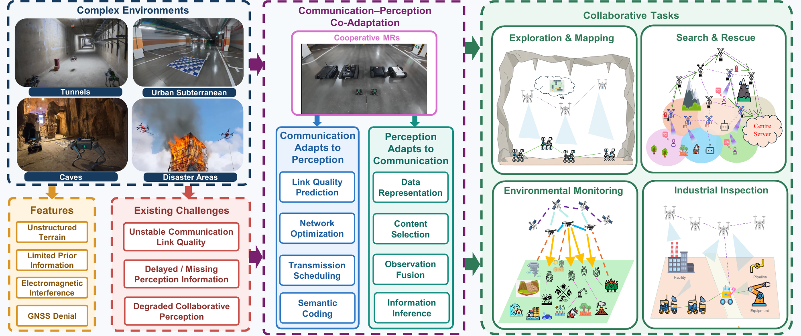
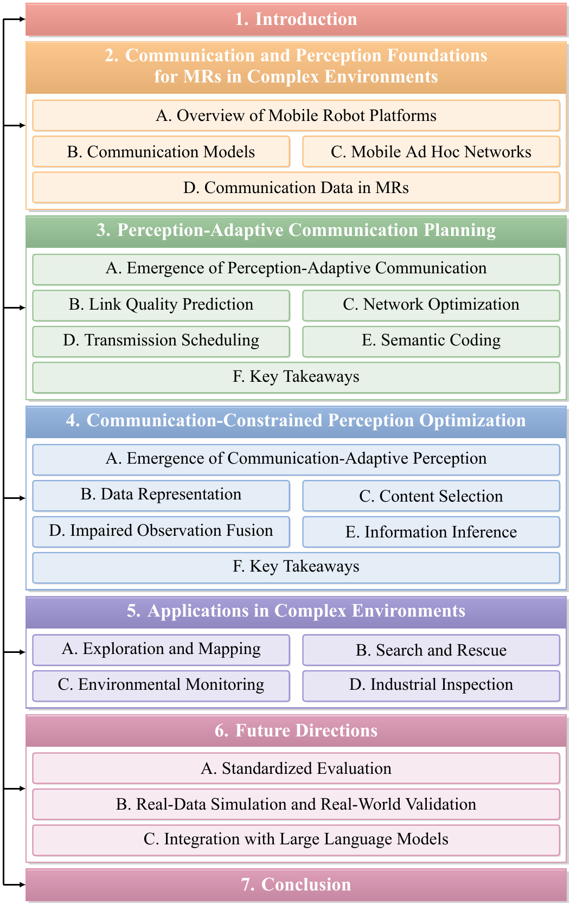
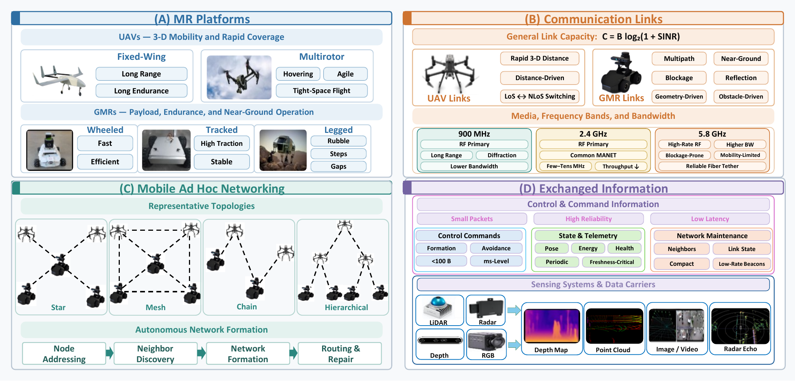
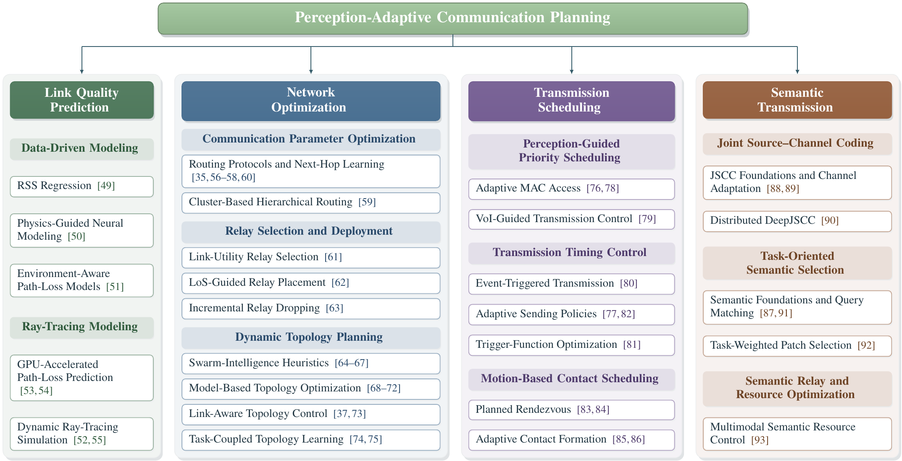
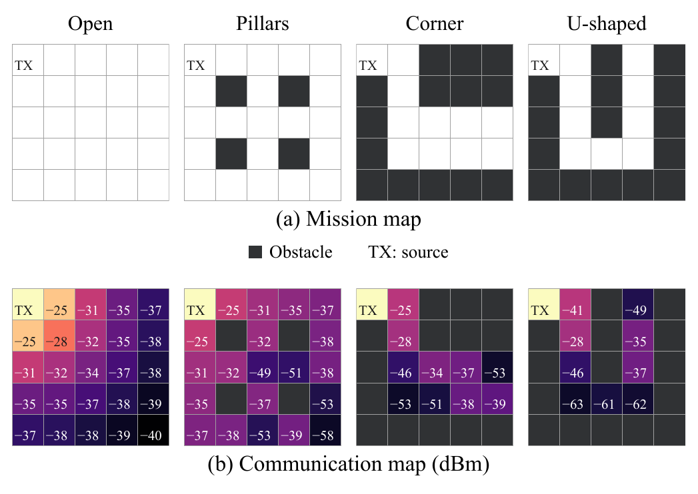
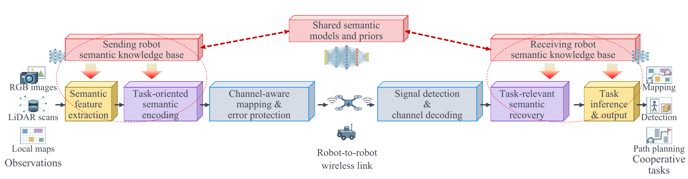
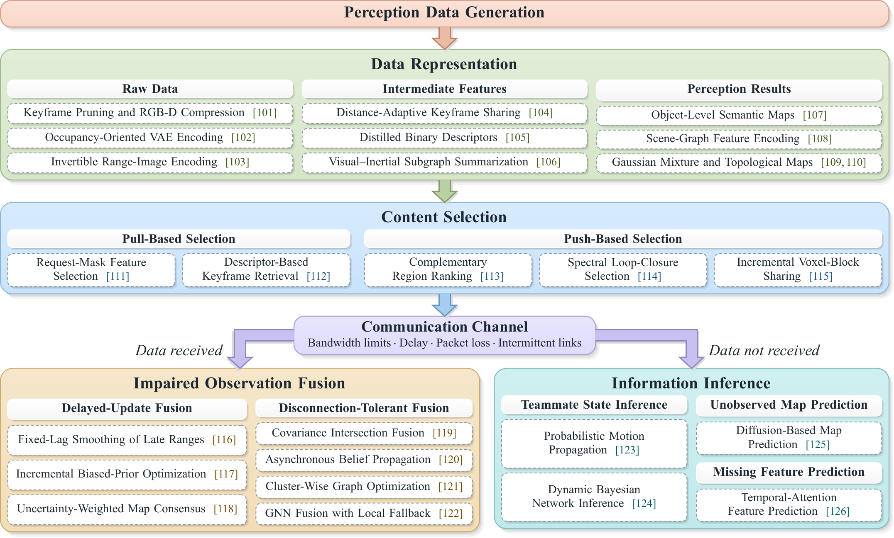
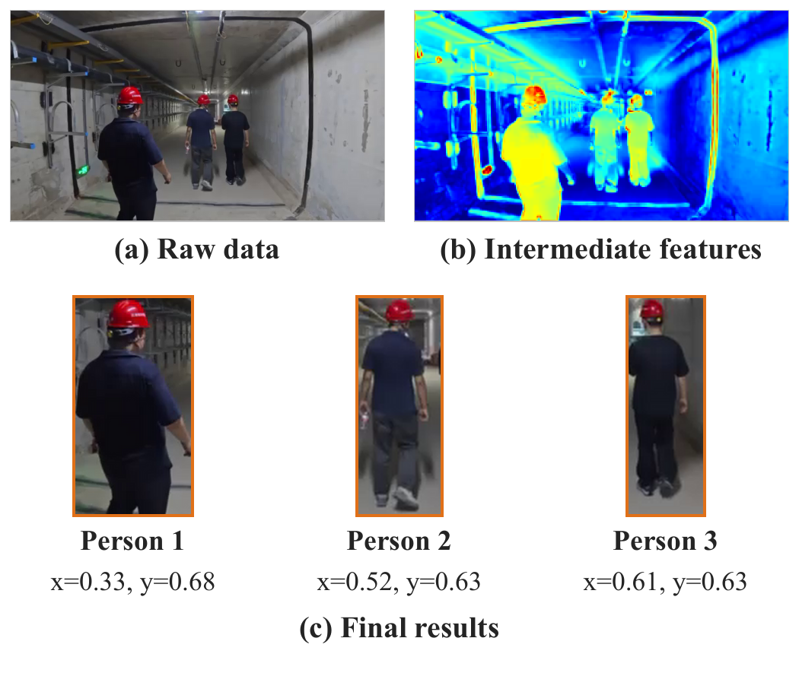
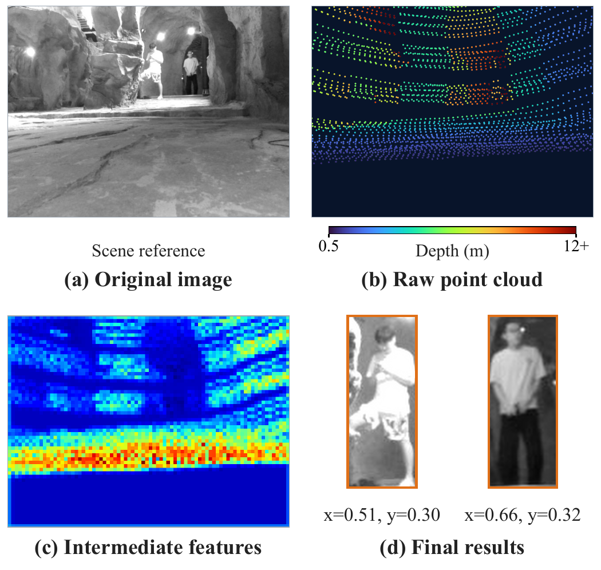

# Mutual Adaptation of Communication and Perception for Cooperative Mobile Robots in Complex Environments

   

## 📢 Foreword

This repository accompanies our survey **"Mutual Adaptation of Communication and Perception for Cooperative Mobile Robots in Complex Environments: A Survey"** and tracks ongoing progress in this field. It collects papers on how cooperative mobile robots (MRs), including ground mobile robots (GMRs) and unmanned aerial vehicles (UAVs), adapt communication and perception to each other in complex environments such as tunnels, urban underground spaces, caves, and disaster sites, where stable satellite positioning, prior maps, and communication infrastructure are unavailable.

In such environments, robot motion keeps changing link quality and network topology, and constrained channels cannot deliver the large volumes of sensing data in time. Following the taxonomy of the survey, the collected works are organized into two complementary directions:

- **Perception-adaptive communication planning**: communication is designed around what cooperative perception needs, covering link quality prediction, network optimization, transmission scheduling, and semantic coding.
- **Communication-constrained perception optimization**: perception adjusts what it shares and how it fuses information according to the channel state, covering data representation, content selection, impaired observation fusion, and information inference.

We then summarize how these techniques support **exploration and mapping, search and rescue, environmental monitoring, and industrial inspection**, and outline future directions.

> This repository is the successor of [MACS-UAV](https://github.com/nzp2179168701-gif/MACS-UAV). The scope is extended from multi-UAV systems to heterogeneous mobile robot teams (GMRs + UAVs), and the taxonomy has been fully redesigned around the mutual adaptation between communication and perception.

## 📰 News

- **[2026.09]** Repository released with the paper list of our survey. The list will be continuously updated.

## 📜 Table of Contents

- [📢 Foreword](#-foreword)
- [📰 News](#-news)
- [🧭 Overview](#-overview)
- [📚 Related Surveys](#-related-surveys)
- [🧱 Communication and Perception Foundations](#-communication-and-perception-foundations)
  - [Mobile Robot Platforms](#mobile-robot-platforms)
  - [Communication Models](#communication-models)
  - [Mobile Ad Hoc Networks](#mobile-ad-hoc-networks)
  - [Communication Data in MRs](#communication-data-in-mrs)
- [📡 Perception-Adaptive Communication Planning](#-perception-adaptive-communication-planning)
  - [Emergence of Perception-Adaptive Communication](#emergence-of-perception-adaptive-communication)
  - [Link Quality Prediction](#link-quality-prediction)
  - [Network Optimization](#network-optimization)
  - [Transmission Scheduling](#transmission-scheduling)
  - [Semantic Coding](#semantic-coding)
- [🔍 Communication-Constrained Perception Optimization](#-communication-constrained-perception-optimization)
  - [Emergence of Communication-Adaptive Perception](#emergence-of-communication-adaptive-perception)
  - [Data Representation](#data-representation)
  - [Content Selection](#content-selection)
  - [Impaired Observation Fusion](#impaired-observation-fusion)
  - [Information Inference](#information-inference)
- [🚁 Applications in Complex Environments](#-applications-in-complex-environments)
- [🔭 Future Directions](#-future-directions)
- [📎 Other Cited Works](#-other-cited-works)
- [📝 Citation](#-citation)
- [🙏 Acknowledgement](#-acknowledgement)

## 🧭 Overview

A collaborative framework for MRs based on the mutual adaptation of communication and perception in complex environments:

Organization of the survey:

## 📚 Related Surveys

Recent surveys related to MR communication and perception. **Category A**: communication optimization methods for MRs; **Category B**: communication-constrained cooperative perception; **Category C**: robot swarm systems in complex environments.

| Year | Venue | Title | Category | Link |
|:---:|:---:|---|:---:|:---:|
|2021|Annu. Rev. Control Robot. Auton. Syst.|Communication-Aware Robotics: Exploiting Motion for Communication|C|[Paper](https://doi.org/10.1146/annurev-control-071420-080708)|
|2023|Robot. Auton. Syst.|A Survey on the Autonomous Exploration of Confined Subterranean Spaces: Perspectives From Real-Word and Industrial Robotic Deployments|C|[Paper](https://doi.org/10.1016/j.robot.2022.104304)|
|2024|IEEE COMST|Computational Intelligence Algorithms for UAV Swarm Networking and Collaboration: A Comprehensive Survey and Future Directions|A|[Paper](https://doi.org/10.1109/COMST.2024.3395358)|
|2024|IEEE COMST|Machine Learning-Aided Operations and Communications of Unmanned Aerial Vehicles: A Contemporary Survey|A|[Paper](https://doi.org/10.1109/COMST.2023.3312221)|
|2024|IEEE COMST|Semantics-Empowered Communications: A Tutorial-Cum-Survey|B|[Paper](https://doi.org/10.1109/COMST.2023.3333342)|
|2024|IEEE OJVT|Advancing UAV Communications: A Comprehensive Survey of Cutting-Edge Machine Learning Techniques|A|[Paper](https://doi.org/10.1109/OJVT.2024.3401024)|
|2024|IEEE TCCN|Key Technologies and Applications of UAVs in Underground Space: A Review|C|[Paper](https://doi.org/10.1109/TCCN.2024.3358545)|
|2025|IEEE COMST|Intellicise Wireless Networks From Semantic Communications: A Survey, Research Issues, and Challenges|B|[Paper](https://doi.org/10.1109/COMST.2024.3443193)|
|2025|IEEE T-ITS|A Survey on Autonomous and Intelligent Swarms of Uncrewed Aerial Vehicles (UAVs)|C|[Paper](https://doi.org/10.1109/TITS.2025.3569500)|
|2026|IEEE COMST|A Survey on DRL-Based UAV Communications and Networking: DRL Fundamentals, Applications and Implementations|A|[Paper](https://doi.org/10.1109/COMST.2025.3581912)|
|2026|IEEE COMST|Advancing Multi-Robot Networks via MLLM-Driven Sensing, Communication, and Computation: A Comprehensive Survey|A|[Paper](https://doi.org/10.1109/COMST.2026.3683120)|
|2026|IEEE COMST|Collaborative Sensing and Communication for Intelligent Connected Vehicles: A Comprehensive Survey|B|[Paper](https://doi.org/10.1109/COMST.2025.3626504)|
|2026|IEEE OJ-COMS|A Survey on Unmanned Aerial Vehicles (UAVs) Communications: State-of-the-Art, Existing Standards, and Future Directions|C|[Paper](https://doi.org/10.1109/OJCOMS.2026.3675046)|
|2026|IEEE Sensors J.|Multi-UAV Cooperative Navigation Based on Multisource Information Fusion: A Review|B|[Paper](https://doi.org/10.1109/JSEN.2025.3646302)|
|2026|Robot. Auton. Syst.|A Survey on Theories and Applications for Multi-Robot Cooperative Hunting|C|[Paper](https://doi.org/10.1016/j.robot.2025.105296)|

## 🧱 Communication and Perception Foundations

Heterogeneous MR platforms, link characteristics of UAVs and GMRs, ad hoc network topologies, and the types of information exchanged within the team.

### Mobile Robot Platforms

Wheeled, tracked, and legged GMRs; fixed-wing and multirotor UAVs; and heterogeneous air-ground teams that combine their complementary capabilities.

| Year | Venue | Title | Category | Link |
|:---:|:---:|---|:---:|:---:|
|2022|Science Robotics|Learning Robust Perceptive Locomotion for Quadrupedal Robots in the Wild|Legged GMR locomotion|[Paper](https://doi.org/10.1126/scirobotics.abk2822)|
|2023|Robot. Auton. Syst.|A Survey on the Autonomous Exploration of Confined Subterranean Spaces: Perspectives From Real-Word and Industrial Robotic Deployments|Heterogeneous teams (subterranean)|[Paper](https://doi.org/10.1016/j.robot.2022.104304)|
|2025|IEEE T-FR|Heterogeneous Robot Teams With Unified Perception and Autonomy: How Team CSIRO Data61 Tied for the Top Score at the DARPA Subterranean Challenge|Heterogeneous team perception|[Paper](https://doi.org/10.1109/TFR.2024.3522063)|
|2025|IEEE T-FR|UAVs Beneath the Surface: Cooperative Autonomy for Subterranean Search and Rescue in DARPA SubT|Air-ground SubT deployment|[Paper](https://doi.org/10.1109/TFR.2024.3492160)|
|2025|IEEE T-ITS|A Survey on Autonomous and Intelligent Swarms of Uncrewed Aerial Vehicles (UAVs)|UAV swarm capabilities / SWaP|[Paper](https://doi.org/10.1109/TITS.2025.3569500)|

### Communication Models

UAV links are dominated by 3-D distance and LoS/NLoS switching, whereas GMR links depend more on local geometry, blockage, and near-ground multipath.

| Year | Venue | Title | Category | Link |
|:---:|:---:|---|:---:|:---:|
|2021|Annu. Rev. Control Robot. Auton. Syst.|Communication-Aware Robotics: Exploiting Motion for Communication|GMR channel / motion–link coupling|[Paper](https://doi.org/10.1146/annurev-control-071420-080708)|
|2025|IEEE T-FR|UAVs Beneath the Surface: Cooperative Autonomy for Subterranean Search and Rescue in DARPA SubT|Proprietary mesh radios (SubT)|[Paper](https://doi.org/10.1109/TFR.2024.3492160)|
|2026|IEEE OJ-COMS|A Survey on Unmanned Aerial Vehicles (UAVs) Communications: State-of-the-Art, Existing Standards, and Future Directions|UAV channel model|[Paper](https://doi.org/10.1109/OJCOMS.2026.3675046)|
|2026|IEEE TAP|Measurement and Modeling of Dynamic Air-to-Ground Channels at 26 GHz in Rural Scenario|Measured air-to-ground channel|[Paper](https://doi.org/10.1109/tap.2026.3672199)|

### Mobile Ad Hoc Networks

Self-organizing MANETs with star, mesh, chain, and hierarchical topologies that operate without infrastructure.

| Year | Venue | Title | Category | Link |
|:---:|:---:|---|:---:|:---:|
|2024|ICCWAMTIP|A Novel Chain Multi-UAV Communication Relay Maintenance Control|Chain topology|[Paper](https://doi.org/10.1109/ICCWAMTIP64812.2024.10873711)|
|2024|IEEE TCOM|Reinforcement Learning Based Energy-Efficient Fast Routing for FANETs|Mesh topology|[Paper](https://doi.org/10.1109/tcomm.2024.3409561)|
|2024|IEEE TMC|Dynamic Topology Organization and Maintenance Algorithms for Autonomous UAV Swarms|Topology organization|[Paper](https://doi.org/10.1109/TMC.2023.3293034)|
|2026|IEEE COMST|A Survey on DRL-Based UAV Communications and Networking: DRL Fundamentals, Applications and Implementations|Star topology|[Paper](https://doi.org/10.1109/COMST.2025.3581912)|
|2026|IEEE Std 1920.2|IEEE Approved Draft Standard for Vehicle to Vehicle Communications for Unmanned Aircraft Systems|UAS V2V standard|[Paper](https://standards.ieee.org/ieee/1920.2/7517/)|
|2026|IEEE TNSE|IACTS: An Intelligent Adaptive Communication Topological Scheme for Subterranean UAV Network|Hierarchical topology|[Paper](https://doi.org/10.1109/TNSE.2025.3591118)|

### Communication Data in MRs

Control commands, state and telemetry, network maintenance messages, and sensing data with different granularities and transmission requirements.

| Year | Venue | Title | Category | Link |
|:---:|:---:|---|:---:|:---:|
|2024|IEEE JSAC|Enhancing Location Awareness: A Perspective on Age of Information and Localization Precision|State & telemetry (AoI)|[Paper](https://doi.org/10.1109/JSAC.2024.3414606)|
|2024|IEEE Network|Task-Oriented Wireless Communications for Collaborative Perception in Intelligent Unmanned Systems|Information granularity|[Paper](https://doi.org/10.1109/MNET.2024.3414144)|
|2024|IEEE TMC|Dynamic Topology Organization and Maintenance Algorithms for Autonomous UAV Swarms|Network maintenance|[Paper](https://doi.org/10.1109/TMC.2023.3293034)|
|2024|IEEE TVT|Formation Control Algorithms for Multi-UAV Systems With Unstable Topologies and Hybrid Delays|Control commands|[Paper](https://doi.org/10.1109/TVT.2024.3383352)|
|2025|IEEE T-FR|Heterogeneous Robot Teams With Unified Perception and Autonomy: How Team CSIRO Data61 Tied for the Top Score at the DARPA Subterranean Challenge|Sensing systems|[Paper](https://doi.org/10.1109/TFR.2024.3522063)|

## 📡 Perception-Adaptive Communication Planning

Communication design that takes the demands of cooperative perception as its starting point, so that limited bandwidth is spent on the perception information that matters most.

### Emergence of Perception-Adaptive Communication

From early negotiation protocols and implicit communication to connectivity-constrained planning and field deployments in the DARPA Subterranean Challenge.

| Year | Venue | Title | Category | Link |
|:---:|:---:|---|:---:|:---:|
|1980|IEEE TC|The Contract Net Protocol: High-Level Communication and Control in a Distributed Problem Solver|Negotiation protocol|[Paper](https://doi.org/10.1109/TC.1980.1675516)|
|1990|IROS|Communication in the autonomous and decentralized robot system ACTRESS|Explicit robot protocol|[Paper](https://doi.org/10.1109/IROS.1990.262503)|
|1998|IEEE TRA|ALLIANCE: An Architecture for Fault Tolerant Multirobot Cooperation|Implicit communication|[Paper](https://doi.org/10.1109/70.681242)|
|2003|ICAR|PERA: Ad-Hoc Routing Protocol for Mobile Robots|Robot ad hoc routing|[Paper](https://api.semanticscholar.org/CorpusID:15926013)|
|2007|IEEE T-RO|Potential Fields for Maintaining Connectivity of Mobile Networks|Connectivity-constrained motion|[Paper](https://doi.org/10.1109/TRO.2007.900642)|
|2012|IEEE TWC|On the Spatial Predictability of Communication Channels|Channel predictability|[Paper](https://doi.org/10.1109/TWC.2012.012712.101835)|
|2017|IEEE Intell. Syst.|Multirobot Exploration of Communication-Restricted Environments: A Survey|Comm-restricted exploration survey|[Paper](https://doi.org/10.1109/MIS.2017.4531226)|
|2021|IEEE RA-L|CHORD: Distributed Data-Sharing via Hybrid ROS 1 and 2 for Multi-Robot Exploration of Large-Scale Complex Environments|SubT mesh data sharing|[Paper](https://doi.org/10.1109/LRA.2021.3061393)|

### Link Quality Prediction

Data-driven channel modeling, communication maps, and ray tracing that give MRs channel priors before links are established.

| Year | Venue | Title | Category | Link |
|:---:|:---:|---|:---:|:---:|
|2022|RSS|PropEM-L: Radio Propagation Environment Modeling and Learning for Communication-Aware Multi-Robot Exploration|Data-driven (RSS regression)|[Paper](https://doi.org/10.15607/RSS.2022.XVIII.014)|
|2023|GLOBECOM Wkshps|Sionna RT: Differentiable Ray Tracing for Radio Propagation Modeling|Ray tracing (differentiable, GPU)|[Paper](https://doi.org/10.1109/GCWkshps58843.2023.10465179)|
|2024|IEEE TAP|Path Loss Prediction in Urban Environments With Sionna-RT Based on Accurate Propagation Scene Models at 2.8 GHz|Ray tracing (urban path loss)|[Paper](https://doi.org/10.1109/TAP.2024.3451214)|
|2025|IEEE AWPL|A High-Performance GPU-Accelerated Ray-Tracing Method for Real-Time V2V Channel Modeling|Ray tracing (dynamic, real-time)|[Paper](https://doi.org/10.1109/LAWP.2025.3567499)|
|2025|IEEE IoT-J|GPRT: A Gaussian Process Regression-Based Radio Map Construction Method for Rugged Terrain|Data-driven (terrain-aware GPR)|[Paper](https://doi.org/10.1109/jiot.2025.3554507)|
|2025|IEEE Network|Wireless Multi-Robot Collaboration: Communications, Perception, Control, and Planning|Ray tracing (overview)|[Paper](https://doi.org/10.1109/mnet.2024.3483829)|
|2025|RSS|FERMI: Flexible Radio Mapping with a Hybrid Propagation Model and Scalable Autonomous Data Collection|Data-driven (physics-guided neural)|[Paper](https://doi.org/10.15607/RSS.2025.XXI.095)|
|2026|IEEE TNSE|IACTS: An Intelligent Adaptive Communication Topological Scheme for Subterranean UAV Network|Communication map|[Paper](https://doi.org/10.1109/TNSE.2025.3591118)|

### Network Optimization

Building and maintaining reliable multi-hop paths for perception data through communication parameter optimization, relay deployment, and dynamic topology planning.

#### Communication Parameter Optimization

| Year | Venue | Title | Category | Link |
|:---:|:---:|---|:---:|:---:|
|2020|IEEE COMST|Routing in Flying Ad Hoc Networks: A Comprehensive Survey|FANET routing survey|[Paper](https://doi.org/10.1109/COMST.2020.2982452)|
|2023|IEEE TVT|A Position-Based Modified OLSR Routing Protocol for Flying Ad Hoc Networks|Position-based routing|[Paper](https://doi.org/10.1109/tvt.2023.3265704)|
|2023|IEEE TVT|Learning to Routing in UAV Swarm Network: A Multi-Agent Reinforcement Learning Approach|Next-hop learning (MARL)|[Paper](https://doi.org/10.1109/tvt.2022.3232815)|
|2024|IEEE TCOM|Reinforcement Learning Based Energy-Efficient Fast Routing for FANETs|Next-hop learning (RL)|[Paper](https://doi.org/10.1109/tcomm.2024.3409561)|
|2025|IEEE TCOM|Learning-Based Energy-Efficient Anti-Jamming FANET Routing With QoS Guarantee|Next-hop learning (RL, QoS)|[Paper](https://doi.org/10.1109/TCOMM.2025.3593615)|
|2026|IEEE TCCN|Communication-Aware Hierarchical Routing for FANET: A Reinforcement Learning Approach|Cluster-based hierarchical routing|[Paper](https://doi.org/10.1109/tccn.2025.3620368)|

#### Relay Selection and Deployment

| Year | Venue | Title | Category | Link |
|:---:|:---:|---|:---:|:---:|
|2023|IEEE RA-L|RELINK: Real-Time Line-of-Sight-Based Deployment Framework of Multi-Robot for Maintaining a Communication Network|LoS-guided relay placement|[Paper](https://doi.org/10.1109/LRA.2023.3326656)|
|2024|IEEE T-FR|An Addendum to NeBula: Toward Extending Team CoSTAR's Solution to Larger Scale Environments|Incremental relay dropping|[Paper](https://doi.org/10.1109/TFR.2024.3430891)|
|2025|IEEE TVT|Cooperative MAC Protocol With Optimal Relay Selection Algorithm for UAVs Ad Hoc Network in Disasters|Link-utility relay selection|[Paper](https://doi.org/10.1109/TVT.2025.3558455)|

#### Dynamic Topology Planning

| Year | Venue | Title | Category | Link |
|:---:|:---:|---|:---:|:---:|
|2024|IEEE OJ-COMS|Optimizing Multi-UAV Multi-User System Through Integrated Sensing and Communication for Age of Information (AoI) Analysis|Swarm-intelligence heuristic (PSO)|[Paper](https://doi.org/10.1109/ojcoms.2024.3489873)|
|2024|IEEE T-ASE|Resilient Multi-Robot Multi-Target Tracking|Model-based (MI-SDP)|[Paper](https://doi.org/10.1109/TASE.2023.3295373)|
|2024|IEEE TVT|AoI-Aware Sensing Scheduling and Trajectory Optimization for Multi-UAV-Assisted Wireless Backscatter Networks|Model-based (Lyapunov)|[Paper](https://doi.org/10.1109/TVT.2024.3402740)|
|2024|IEEE TWC|Joint Optimization of UAV Deployment and Directional Antenna Orientation for Multi-UAV Cooperative Sensing System|Model-based (convex)|[Paper](https://doi.org/10.1109/twc.2024.3407837)|
|2024|IROS|Integrating Online Learning and Connectivity Maintenance for Communication-Aware Multi-Robot Coordination|Link-aware topology control|[Paper](https://doi.org/10.1109/IROS58592.2024.10802189)|
|2025|Autonomous Robots|Fast k-Connectivity Restoration in Multi-Robot Systems for Robust Communication Maintenance: Algorithmic and Learning-Based Solutions|Model-based (k-connectivity)|[Paper](https://doi.org/10.1007/s10514-025-10224-5)|
|2025|IEEE IoT-J|Game-Theoretic Optimization for Multi-UAV Integrated Sensing and Communication Networks|Model-based (game theory)|[Paper](https://doi.org/10.1109/jiot.2025.3597543)|
|2025|IEEE LNET|GNNPPOR: A Proximal Policy Optimization Multi-Factor Joint Routing Approach Based on Graph Neural Networks in FANETs|Task-coupled topology learning|[Paper](https://doi.org/10.1109/lnet.2025.3542762)|
|2025|IEEE TCE|Optimizing Resource Utilization in Consumer Electronics Networks Through an Enhanced Grey Wolf Optimization Algorithm With UAV Collaboration|Swarm-intelligence heuristic (GWO)|[Paper](https://doi.org/10.1109/TCE.2025.3572315)|
|2025|IEEE TSMC|Cognitive Robotics: Enhancing Multirobot Target Search in Unknown Environments Through Adaptive Communication Strategies|Swarm-intelligence heuristic|[Paper](https://doi.org/10.1109/TSMC.2025.3540059)|
|2025|MSWiM|Cooperative Multi-Target Search with UAV Swarms: Evolutionary vs. Reinforcement Learning Strategies|Swarm-intelligence heuristic (evolutionary)|[Paper](https://doi.org/10.1109/mswim67937.2025.11308767)|
|2026|IEEE TNSE|IACTS: An Intelligent Adaptive Communication Topological Scheme for Subterranean UAV Network|Link-aware topology control|[Paper](https://doi.org/10.1109/TNSE.2025.3591118)|
|2026|IEEE TVT|Heterogeneous UAVs Trajectory Optimization for Post-Disaster Target Search Based on MARL With Graph Attention Network|Task-coupled topology learning|[Paper](https://doi.org/10.1109/TVT.2025.3594534)|

### Transmission Scheduling

Deciding what to send, when to send it, and where robots should meet so that perception data are delivered under intermittent connectivity.

MAC and transport-layer background:

| Year | Venue | Title | Category | Link |
|:---:|:---:|---|:---:|:---:|
|2026|IEEE COMST|Evaluating Transport Layer Congestion Control Algorithms: A Comprehensive Survey|Transport congestion control|[Paper](https://doi.org/10.1109/COMST.2025.3533303)|
|2026|IEEE IoT-J|H-SATMAC: A Hybrid Self-Adaptive TDMA-Based MAC Protocol for Large-Scale UAV Ad-Hoc Networks|Hybrid TDMA MAC|[Paper](https://doi.org/10.1109/JIOT.2025.3577782)|

#### Perception-Guided Priority Scheduling

| Year | Venue | Title | Category | Link |
|:---:|:---:|---|:---:|:---:|
|2021|IEEE COMMAG|Improving 802.11p for Delivery of Safety-Critical Navigation Information in Robot-to-Robot Communication Networks|Adaptive MAC access|[Paper](https://doi.org/10.1109/MCOM.001.2000545)|
|2026|AAAI|VIL2C: Value-of-Information Aware Low-Latency Communication for Multi-Agent Reinforcement Learning|VoI-guided transmission control|[Paper](https://doi.org/10.1609/aaai.v40i35.40234)|

#### Transmission Timing Control

| Year | Venue | Title | Category | Link |
|:---:|:---:|---|:---:|:---:|
|2025|ICRA|Reinforcement Learning Driven Multi-Robot Exploration via Explicit Communication and Density-Based Frontier Search|Adaptive sending policy (MARL)|[Paper](https://doi.org/10.1109/ICRA55743.2025.11128566)|
|2025|IROS|Distributed Fault-Tolerant Multi-Robot Cooperative Localization in Adversarial Environments|Event-triggered transmission|[Paper](https://doi.org/10.1109/IROS60139.2025.11246042)|
|2026|IEEE TCCN|LLM-Based Dynamic Event-Triggered Communication for Multi-UAV Formation Control in Urban Environments|Trigger-function optimization (LLM)|[Paper](https://doi.org/10.1109/TCCN.2025.3644040)|

#### Motion-Based Contact Scheduling

| Year | Venue | Title | Category | Link |
|:---:|:---:|---|:---:|:---:|
|2024|ICRA|Enabling Large-scale Heterogeneous Collaboration with Opportunistic Communications|Adaptive contact formation|[Paper](https://doi.org/10.1109/ICRA57147.2024.10611469)|
|2024|IROS|Communication-Constrained Multi-Robot Exploration with Intermittent Rendezvous|Planned rendezvous|[Paper](https://doi.org/10.1109/IROS58592.2024.10802343)|
|2024|IROS|IR²: Implicit Rendezvous for Robotic Exploration Teams under Sparse Intermittent Connectivity|Adaptive contact formation|[Paper](https://doi.org/10.1109/IROS58592.2024.10801761)|
|2026|IEEE RA-L|CoCoPlan: Adaptive Coordination and Communication for Multi-Robot Systems in Dynamic and Unknown Environments|Planned rendezvous|[Paper](https://doi.org/10.1109/LRA.2026.3656769)|

### Semantic Coding

Joint source-channel coding and task-oriented semantic selection that transmit the meaning needed by the perception task instead of every bit.

| Year | Venue | Title | Category | Link |
|:---:|:---:|---|:---:|:---:|
|1953|ETC: Rev. Gen. Semantics|Recent Contributions to the Mathematical Theory of Communication|Semantic foundations|[Paper](https://www.jstor.org/stable/42581364)|
|2025|IEEE TCOM|Resource Allocation for Multi-Modal Semantic Communication in UAV Collaborative Networks|Semantic relay & resource optimization|[Paper](https://doi.org/10.1109/TCOMM.2025.3552303)|
|2025|IEEE WCL|Channel-Aware Deep Joint Source-Channel Coding for Multi-Task Oriented Semantic Communication|Channel-aware DeepJSCC|[Paper](https://doi.org/10.1109/lwc.2025.3548084)|
|2025|Proc. IEEE|Joint Source–Channel Coding: Fundamentals and Recent Progress in Practical Designs|JSCC foundations|[Paper](https://doi.org/10.1109/JPROC.2024.3477331)|
|2026|IEEE TMC|Distributed Deep Joint Source-Channel Coding of Videos in Autonomous Aerial Vehicle Networks|Distributed DeepJSCC|[Paper](https://doi.org/10.1109/TMC.2026.3700200)|
|2026|IEEE TVT|Adaptive Semantic Communication for UAV/UGV Cooperative Path Planning|Task-weighted patch selection|[Paper](https://doi.org/10.1109/TVT.2026.3653997)|
|2026|IEEE TVT|Design of Multi-UAV Cooperative Deep Semantic Autoencoders for Communication Networks|Semantic query matching|[Paper](https://doi.org/10.1109/TVT.2026.3673755)|

## 🔍 Communication-Constrained Perception Optimization

The perception side adjusts its data representation, content selection, fusion, and inference according to bandwidth limits, delay, packet loss, and intermittent links.

### Emergence of Communication-Adaptive Perception

From early studies on what robots need to communicate to data-efficient decentralized SLAM and learned feature sharing.

| Year | Venue | Title | Category | Link |
|:---:|:---:|---|:---:|:---:|
|1994|Autonomous Robots|Communication in Reactive Multiagent Robotic Systems|Communication vs. task performance|[Paper](https://doi.org/10.1007/BF00735341)|
|2009|ICRA|Cooperative Multi-Robot Localization under Communication Constraints|Quantized cooperative localization|[Paper](https://doi.org/10.1109/ROBOT.2009.5152606)|
|2013|ICRA|DDF-SAM 2.0: Consistent Distributed Smoothing and Mapping|Factor-graph summarization|[Paper](https://doi.org/10.1109/ICRA.2013.6631323)|
|2013|IROS|Multi-Robot SLAM Using Condensed Measurements|Condensed measurements|[Paper](https://doi.org/10.1109/IROS.2013.6696483)|
|2018|ICRA|Data-Efficient Decentralized Visual SLAM|Data-efficient decentralized SLAM|[Paper](https://doi.org/10.1109/ICRA.2018.8461155)|
|2022|IEEE RA-L|Multi-Robot Collaborative Perception With Graph Neural Networks|Learned feature sharing|[Paper](https://doi.org/10.1109/LRA.2022.3141661)|
|2026|Autonomous Robots|Decentralized Multi-Robot Exploration Under Low-Bandwidth Communications|Low-bandwidth exploration|[Paper](https://doi.org/10.1007/s10514-025-10234-3)|

### Data Representation

Choosing the level at which information is shared: raw data, intermediate features, or perception results.

  &nbsp;&nbsp;
  

Shared data representations for RGB-based perception (left) and point-cloud-based perception (right).

| Year | Venue | Title | Category | Link |
|:---:|:---:|---|:---:|:---:|
|2022|IEEE RA-L|MR-GMMapping: Communication Efficient Multi-Robot Mapping System via Gaussian Mixture Model|Perception results (Gaussian mixture map)|[Paper](https://doi.org/10.1109/LRA.2022.3145059)|
|2022|IEEE RA-L|MR-TopoMap: Multi-Robot Exploration Based on Topological Map in Communication Restricted Environment|Perception results (topological map)|[Paper](https://doi.org/10.1109/LRA.2022.3192765)|
|2022|Robot. Auton. Syst.|Sharing Visual-Inertial Data for Collaborative Decentralized Simultaneous Localization and Mapping|Intermediate features (VI subgraph summarization)|[Paper](https://doi.org/10.1016/j.robot.2021.103933)|
|2023|ICRA|Descriptor Distillation for Efficient Multi-Robot SLAM|Intermediate features (distilled binary descriptors)|[Paper](https://doi.org/10.1109/ICRA48891.2023.10160541)|
|2024|ICRA|RecNet: An Invertible Point Cloud Encoding through Range Image Embeddings for Multi-Robot Map Sharing and Reconstruction|Raw data (invertible range-image encoding)|[Paper](https://doi.org/10.1109/ICRA57147.2024.10611602)|
|2024|IEEE T-RO|D²SLAM: Decentralized and Distributed Collaborative Visual-Inertial SLAM System for Aerial Swarm|Intermediate features (distance-adaptive keyframes)|[Paper](https://doi.org/10.1109/TRO.2024.3422003)|
|2024|IEEE TIM|CCMD-SLAM: Communication-Efficient Centralized Multirobot Dense SLAM With Real-Time Point Cloud Maintenance|Raw data (keyframe pruning, RGB-D compression)|[Paper](https://doi.org/10.1109/TIM.2024.3398100)|
|2025|IEEE RA-L|Collaborative Exploration With a Marsupial Ground-Aerial Robot Team Through Task-Driven Map Compression|Raw data (occupancy-oriented VAE)|[Paper](https://doi.org/10.1109/LRA.2025.3609040)|
|2025|IEEE RA-L|MR-COGraphs: Communication-Efficient Multi-Robot Open-Vocabulary Mapping System via 3D Scene Graphs|Perception results (scene-graph encoding)|[Paper](https://doi.org/10.1109/LRA.2025.3561569)|
|2025|IEEE T-RO|SlideSLAM: Sparse, Lightweight, Decentralized Metric-Semantic SLAM for Multirobot Navigation|Perception results (object-level semantic map)|[Paper](https://doi.org/10.1109/TRO.2025.3629786)|

### Content Selection

Selecting which candidate regions, keyframes, submaps, or loop closures to send, either on request of the receiver (pull) or by gain estimation at the sender (push).

| Year | Venue | Title | Category | Link |
|:---:|:---:|---|:---:|:---:|
|2022|IEEE RA-L|Data-Efficient Collaborative Decentralized Thermal-Inertial Odometry|Pull-based (descriptor-based keyframe retrieval)|[Paper](https://doi.org/10.1109/LRA.2022.3194675)|
|2024|IEEE RA-L|LECES: A Low-Bandwidth and Efficient Collaborative Exploration System With Distributed Multi-UAV|Push-based (incremental voxel-block sharing)|[Paper](https://doi.org/10.1109/LRA.2024.3433200)|
|2024|IEEE RA-L|Swarm-SLAM: Sparse Decentralized Collaborative Simultaneous Localization and Mapping Framework for Multi-Robot Systems|Push-based (spectral loop-closure selection)|[Paper](https://doi.org/10.1109/LRA.2023.3333742)|
|2024|NeurIPS|Drones Help Drones: A Collaborative Framework for Multi-Drone Object Trajectory Prediction and Beyond|Push-based (complementary region ranking)|[Paper](https://doi.org/10.52202/079017-2061)|
|2025|ICCV|MCOP: Multi-UAV Collaborative Occupancy Prediction|Pull-based (request-mask features)|[Paper](https://doi.org/10.1109/ICCV51701.2025.02529)|

### Impaired Observation Fusion

Fusing delayed, lost, or correlated information without temporal misalignment or double counting.

| Year | Venue | Title | Category | Link |
|:---:|:---:|---|:---:|:---:|
|2022|IEEE T-RO|Resilient and Consistent Multirobot Cooperative Localization With Covariance Intersection|Disconnection-tolerant (covariance intersection)|[Paper](https://doi.org/10.1109/TRO.2021.3104965)|
|2023|IROS|Resilient and Distributed Multi-Robot Visual SLAM: Datasets, Experiments, and Lessons Learned|Disconnection-tolerant (cluster-wise PGO)|[Paper](https://doi.org/10.1109/IROS55552.2023.10342377)|
|2024|IEEE RA-L|Distributed Simultaneous Localisation and Auto-Calibration Using Gaussian Belief Propagation|Disconnection-tolerant (async. belief propagation)|[Paper](https://doi.org/10.1109/LRA.2024.3352361)|
|2024|RSS|iMESA: Incremental Distributed Optimization for Collaborative Simultaneous Localization and Mapping|Delayed-update (incremental biased prior)|[Paper](https://doi.org/10.15607/RSS.2024.XX.085)|
|2025|IEEE RA-L|GNN-Based Decentralized Perception in Multi-Robot Systems for Predicting Worker Actions|Disconnection-tolerant (GNN + local fallback)|[Paper](https://doi.org/10.1109/LRA.2025.3566610)|
|2025|RSS|RAMEN: Real-time Asynchronous Multi-agent Neural Implicit Mapping|Delayed-update (uncertainty-weighted consensus)|[Paper](https://doi.org/10.15607/RSS.2025.XXI.041)|
|2026|IEEE RA-L|Decentralized and Fully Onboard: Range-Aided Cooperative Localization and Navigation on Micro Aerial Vehicles|Delayed-update (fixed-lag smoothing)|[Paper](https://doi.org/10.1109/LRA.2025.3630870)|

### Information Inference

Estimating teammate states, unobserved maps, and missing features when shared information does not arrive in time.

| Year | Venue | Title | Category | Link |
|:---:|:---:|---|:---:|:---:|
|2024|IEEE RA-L|Robust Cooperative Localization With Failed Communication and Biased Measurements|Teammate state (probabilistic motion)|[Paper](https://doi.org/10.1109/LRA.2024.3362682)|
|2024|IEEE RA-L|The Sound of Silence: Exploiting Information From the Lack of Communication|Teammate state (dynamic Bayesian network)|[Paper](https://doi.org/10.1109/LRA.2024.3410158)|
|2024|ITSC|Leveraging Temporal Contexts to Enhance Vehicle-Infrastructure Cooperative Perception|Missing feature (temporal attention)|[Paper](https://doi.org/10.1109/ITSC58415.2024.10920140)|
|2026|IEEE T-RO|4CNet: A Diffusion Approach to Map Prediction for Decentralized Multirobot Exploration|Unobserved map (diffusion prediction)|[Paper](https://doi.org/10.1109/TRO.2026.3666133)|

## 🚁 Applications in Complex Environments

### Exploration and Mapping

| Year | Venue | Title | Link |
|:---:|:---:|---|:---:|
|2022|IEEE T-RO|Kimera-Multi: Robust, Distributed, Dense Metric-Semantic SLAM for Multi-Robot Systems|[Paper](https://doi.org/10.1109/TRO.2021.3137751)|
|2022|NeurIPS|Where2comm: Communication-Efficient Collaborative Perception via Spatial Confidence Maps|[Paper](https://doi.org/10.52202/068431-0352)|
|2023|IEEE RA-L|Cooperative Exploration of Heterogeneous UAVs in Mountainous Environments by Constructing Steady Communication|[Paper](https://doi.org/10.1109/LRA.2023.3316070)|
|2023|IEEE T-RO|RACER: Rapid Collaborative Exploration With a Decentralized Multi-UAV System|[Paper](https://doi.org/10.1109/TRO.2023.3236945)|
|2024|IEEE T-RO|Present and Future of SLAM in Extreme Environments: The DARPA SubT Challenge|[Paper](https://doi.org/10.1109/TRO.2023.3323938)|
|2025|IEEE TIM|DRCM-CSLAM: Distributed Robust and Communication-Efficient Multirobot Cooperative LiDAR–Inertial SLAM|[Paper](https://doi.org/10.1109/TIM.2025.3565109)|
|2025|IEEE TMC|Streamlining Data Transfer in Collaborative SLAM Through Bandwidth-Aware Map Distillation|[Paper](https://doi.org/10.1109/TMC.2025.3549367)|
|2026|Autonomous Robots|Decentralized Multi-Robot Exploration Under Low-Bandwidth Communications|[Paper](https://doi.org/10.1007/s10514-025-10234-3)|

### Search and Rescue

| Year | Venue | Title | Link |
|:---:|:---:|---|:---:|
|2022|IEEE RA-L|ACHORD: Communication-Aware Multi-Robot Coordination With Intermittent Connectivity|[Paper](https://doi.org/10.1109/LRA.2022.3193240)|
|2024|CAC|A Method of Relay UAV Deployment for Emergency Communication Scenarios in Disaster Areas|[Paper](https://doi.org/10.1109/cac63892.2024.10865604)|
|2024|IEEE IoT-J|Cooperative UAV Trajectory Design for Disaster Area Emergency Communications: A Multiagent PPO Method|[Paper](https://doi.org/10.1109/JIOT.2023.3320796)|
|2025|IEEE IoT-J|Dynamic Task Allocation for UAV Swarms in Maritime Rescue Scenarios Based on PG-MAPPO|[Paper](https://doi.org/10.1109/JIOT.2025.3584767)|
|2025|IEEE T-FR|Heterogeneous Robot Teams With Unified Perception and Autonomy: How Team CSIRO Data61 Tied for the Top Score at the DARPA Subterranean Challenge|[Paper](https://doi.org/10.1109/TFR.2024.3522063)|
|2025|IEEE T-FR|UAVs Beneath the Surface: Cooperative Autonomy for Subterranean Search and Rescue in DARPA SubT|[Paper](https://doi.org/10.1109/TFR.2024.3492160)|

### Environmental Monitoring

| Year | Venue | Title | Link |
|:---:|:---:|---|:---:|
|2024|ICRA|Multi-Robot Informative Path Planning from Regression with Sparse Gaussian Processes|[Paper](https://doi.org/10.1109/ICRA57147.2024.10610484)|
|2025|IEEE T-ASE|Informative Trajectory Planning for Air-Ground Cooperative Monitoring of Spatiotemporal Fields|[Paper](https://doi.org/10.1109/tase.2024.3382730)|
|2025|IEEE TWC|A Reinforcement Learning Approach for Wildfire Tracking With UAV Swarms|[Paper](https://doi.org/10.1109/twc.2024.3524324)|

### Industrial Inspection

| Year | Venue | Title | Link |
|:---:|:---:|---|:---:|
|2018|IEEE TII|Energy-Efficient Industrial Internet of UAVs for Power Line Inspection in Smart Grid|[Paper](https://doi.org/10.1109/TII.2018.2794320)|
|2022|IEEE RA-L|Stronger Together: Air-Ground Robotic Collaboration Using Semantics|[Paper](https://doi.org/10.1109/LRA.2022.3191165)|
|2023|ICRA|Active Metric-Semantic Mapping by Multiple Aerial Robots|[Paper](https://doi.org/10.1109/ICRA48891.2023.10161564)|
|2023|IEEE RA-L|A Vision-Based Autonomous UAV Inspection Framework for Unknown Tunnel Construction Sites With Dynamic Obstacles|[Paper](https://doi.org/10.1109/LRA.2023.3290415)|
|2024|IEEE TCST|Localization, Planning, and Control of a UAV for Rapid Complete Coverage Bridge Inspection in Large-Scale Intermittent GPS Environments|[Paper](https://doi.org/10.1109/TCST.2024.3366695)|
|2024|IEEE TII|UAV Trajectory Planning via Viewpoint Resampling for Autonomous Remote Inspection of Industrial Facilities|[Paper](https://doi.org/10.1109/TII.2024.3361019)|
|2025|ICRA|Communication-Aware Iterative Map Compression for Online Path-Planning|[Paper](https://doi.org/10.1109/ICRA55743.2025.11128672)|

## 🔭 Future Directions

- **Standardized evaluation**: There is still no unified framework for jointly evaluating communication and perception. Robot scale, task area, channel model, sensor configuration, and task metrics are usually set independently by each study, and communication and perception performance are rarely quantified with shared metrics.
- **Validation with real-environment data and field experiments**: Measured air-to-ground channels in complex terrain, dynamic inter-robot channels, and synchronously annotated multi-sensor data remain scarce. Field experiments are needed to expose the gap between simulation and deployment.
- **Integration with large language models**: LLMs may adjust communication and perception strategies from link-state and perception-quality feedback, but their size and inference cost must be reconciled with the limited onboard resources of MRs.

| Year | Venue | Title | Category | Link |
|:---:|:---:|---|:---:|:---:|
|2025|ICRA|COHERENT: Collaboration of Heterogeneous Multi-Robot System with Large Language Models|LLM-based heterogeneous collaboration|[Paper](https://doi.org/10.1109/icra55743.2025.11127808)|
|2025|IEEE Network|Wireless Multi-Robot Collaboration: Communications, Perception, Control, and Planning|Standardized evaluation|[Paper](https://doi.org/10.1109/mnet.2024.3483829)|
|2026|IEEE Network|Ubiquitous UAV Communication Enabled Low-Altitude Economy: Applications, Techniques, and 3GPP's Efforts|Real-world validation|[Paper](https://doi.org/10.1109/mnet.2025.3574922)|
|2026|IEEE TAP|Measurement and Modeling of Dynamic Air-to-Ground Channels at 26 GHz in Rural Scenario|Real-world channel data|[Paper](https://doi.org/10.1109/tap.2026.3672199)|
|2026|IEEE TMC|Scalable UAV Multi-Hop Networking via Multi-Agent Reinforcement Learning With Large Language Models|LLM-empowered networking|[Paper](https://doi.org/10.1109/TMC.2026.3669346)|

## 📎 Other Cited Works

Application examples and related techniques cited in the introduction of the survey.

| Year | Venue | Title | Category | Link |
|:---:|:---:|---|:---:|:---:|
|2023|IEEE Access|Multi-UAV Collaboration and IMU Fusion Localization Method in Partial GNSS-Denied Scenarios|GNSS-denied localization|[Paper](https://doi.org/10.1109/ACCESS.2023.3315870)|
|2024|IEEE Access|Reinforcement Learning Based Trajectory Planning for Multi-UAV Load Transportation|Logistics / load transportation|[Paper](https://doi.org/10.1109/ACCESS.2024.3470509)|
|2024|IEEE COMML|Multi-Target Tracking With Dual-Functional Radar-Communication UAV Swarm|Tracking (DFRC swarm)|[Paper](https://doi.org/10.1109/LCOMM.2024.3434446)|
|2024|IEEE TNSE|Frisbee: An Efficient Data Sharing Framework for UAV Swarms|Perception-oriented data sharing|[Paper](https://doi.org/10.1109/TNSE.2024.3479695)|
|2024|IEEE/CAA JAS|Optimal Positioning Strategy for Multi-Camera Zooming Drones|Localization assistance|[Paper](https://doi.org/10.1109/JAS.2024.124455)|
|2025|IEEE TVT|DPCS-SDMA: An ISAC-Aided MAC Protocol for Flying Ad Hoc Networks|ISAC-aided MAC|[Paper](https://doi.org/10.1109/TVT.2025.3555102)|
|2026|IEEE IoT Mag.|Integrated Sensing, Communication and Control Enabled Agile UAV Swarm|Integrated sensing, comm. & control|[Paper](https://doi.org/10.1109/MIOT.2025.3647932)|

## 📝 Citation

The survey is in preparation for submission. The citation will be added here once the paper is available.

## 🙏 Acknowledgement

The organization of this repository follows our earlier repository [MACS-UAV](https://github.com/nzp2179168701-gif/MACS-UAV) and is inspired by [DLLV](https://github.com/dlgxwcvhehks/DLLV). We thank the authors of all the works listed here. If you find a missing or misclassified paper, please open an issue or a pull request.
